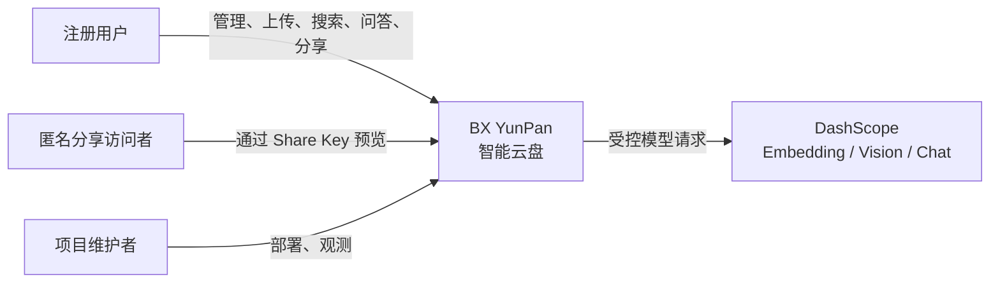
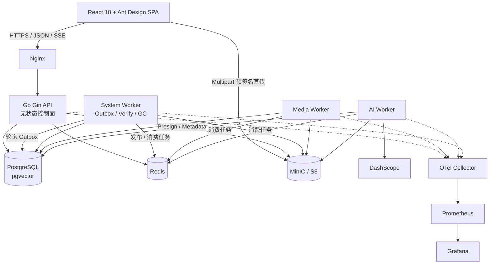
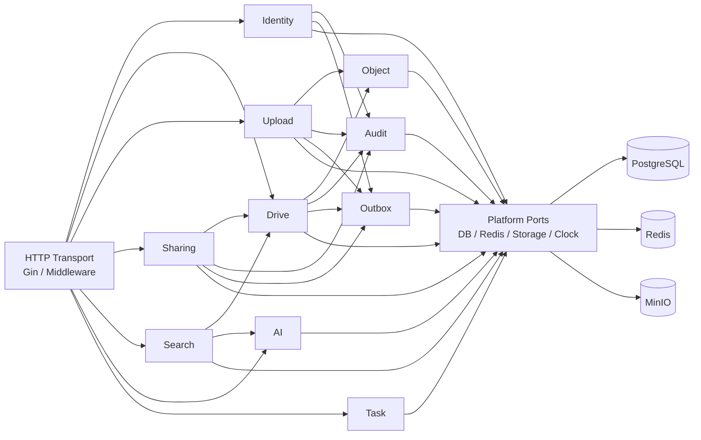

# BX YunPan C4 架构

- 版本：2.0
- 日期：2026-08-14
- 状态：M0 基线

本文用 C4 的 Context、Container、Component 三个层次说明目标系统。图只表达稳定边界，不展开类和函数。

## 1. System Context



系统职责：

- 管理用户自己的目录、逻辑文件、单文件分享和异步任务。
- 将文件内容保存到私有对象存储，不提供永久公开 Object URL。
- 自动理解文件并提供权限感知的全文、向量检索和带引用问答。

外部边界：

- DashScope 是可替换 Provider，不拥有业务权限和文件元数据。
- 主仓库只保留 Go/React 实现，不运行旧 C/C++ 系统，也不做双写。
- 浏览器只拿短时、单对象、单操作的预签名 URL。

## 2. Container



### 2.1 Container 职责

| Container | 职责 | 不负责 |
|---|---|---|
| React SPA | 文件工作台、上传调度、分享访问、AI 搜索、任务状态 | 保存 Refresh Token、代理文件内容 |
| Nginx | TLS、静态资源、反向代理、部署级访问控制 | 业务鉴权 |
| Gin API | 认证授权、业务事务、预签名、OpenAPI、SSE | 大文件传输、缩略图、长耗时 AI |
| Media Worker | 图片探测、缩略图、预览变体 | 用户目录写操作 |
| AI Worker | 提取、OCR/Vision、Chunk、摘要、Embedding | 最终权限判定 |
| System Worker | Outbox、对象强校验、GC、过期与补偿 | 同步 HTTP 请求 |
| PostgreSQL | 业务事实、FTS、Vector、Outbox、审计 | 文件二进制 |
| Redis | Asynq、限流、Session 辅助、短期缓存 | 不可重建业务事实 |
| MinIO | 原文件、缩略图、临时上传对象 | 用户目录和授权关系 |

### 2.2 数据面与控制面

```text
控制面：Browser -> Nginx -> API -> PostgreSQL/Redis/MinIO Presign
数据面：Browser -> Nginx /storage -> MinIO Multipart
```

Nginx 只转发对象字节流，不经过 Go API。内部 `S3_ENDPOINT` 与签名使用的 `S3_PUBLIC_ENDPOINT` 独立配置，避免把容器 DNS 暴露给浏览器，并为独立对象存储域名或公有云 S3 留出迁移边界。API 的内存占用不得随上传文件大小线性增长。下载同样由 API 鉴权后签发短期 URL，再由浏览器访问 MinIO。

## 3. API Component



依赖规则：

- Transport 只做协议转换、校验、认证上下文注入和错误映射。
- Application 层定义 Use Case 与事务边界。
- Domain 不依赖 Gin、GORM、Redis、MinIO 或模型 SDK。
- Repository 接口由使用它的业务模块定义，Adapter 放在模块或 Platform 中。
- 模块不得直接修改其他模块的表；同步协作用窄接口，异步副作用写 Outbox。
- Search 在数据库查询阶段连接授权 FileEntry，禁止先召回全局向量再在内存过滤。

## 4. 数据所有权

| 模块 | 独占写入的数据 |
|---|---|
| Identity | `users`、`refresh_sessions` |
| Drive | `folders`、`file_entries` |
| Object | `file_objects`、`object_variants` |
| Upload | `upload_sessions`、`upload_parts` |
| Sharing | `shares`、`share_imports` |
| AI | `ai_documents`、`ai_chunks` |
| Task | `async_tasks`、`event_consumptions` |
| Outbox | `outbox_events` |
| Audit | `audit_logs` |

跨模块事务只由 Application Use Case 编排，并通过模块接口执行；不能在 Handler 中直接拼接跨表写入。

## 5. 部署与扩容

- API 无本地持久状态，可启动多个副本。
- Media、AI、System 使用同一个 Worker 二进制，通过队列配置独立部署和扩容。
- PostgreSQL 是一致性中心；Redis 和 Worker 暂停不能导致业务事实丢失。
- MinIO 本地用于展示，生产兼容 S3/OSS 的替换通过 `ObjectStorage` Port 完成。
- 首版不拆微服务；AI/Search 和 Upload/Object 是未来优先拆分边界。

## 6. 关联决策

- [ADR-001：模块化单体](../adr/ADR-001-modular-monolith.md)
- [ADR-002：MinIO/S3 对象存储](../adr/ADR-002-minio-object-storage.md)
- [ADR-003：PostgreSQL 与 pgvector](../adr/ADR-003-postgresql-pgvector.md)
- [ADR-004：Transactional Outbox](../adr/ADR-004-transactional-outbox.md)
- [ADR-005：Asynq 后台任务](../adr/ADR-005-asynq-jobs.md)
