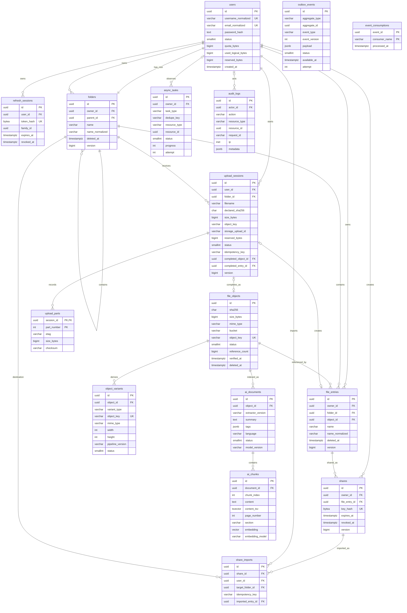

# BX YunPan ERD

- 版本：2.0
- 日期：2026-08-14
- 状态：M0 逻辑模型

本文是逻辑 ERD。字段类型、部分唯一索引、状态约束和迁移顺序以版本化 SQL Migration 为最终事实来源。



## 1. 关键唯一约束

| 表 | 约束 |
|---|---|
| `folders` | 每用户一个 active 根目录；active 子目录 `(owner_id, parent_id, name_normalized)` 唯一 |
| `file_entries` | active `(owner_id, folder_id, name_normalized)` 唯一 |
| `file_objects` | `(sha256, size_bytes)` 唯一 |
| `upload_sessions` | `(user_id, idempotency_key)` 唯一 |
| `share_imports` | `(user_id, share_id, idempotency_key)` 唯一 |
| `object_variants` | `(object_id, variant_type, pipeline_version)` 唯一 |
| `ai_documents` | `(object_id, extractor_version, model_version)` 唯一 |
| `ai_chunks` | `(document_id, chunk_index, embedding_model)` 唯一 |
| `async_tasks` | `(task_type, dedupe_key)` 唯一 |
| `event_consumptions` | `(event_id, consumer_name)` 主键 |

## 2. 分享与审计引用

`shares.file_entry_id` 只引用单个 FileEntry。Sharing 模块在创建、解析和导入时校验文件属于 Share Owner、Entry 未删除、Share 未撤销且未过期。导入事务创建新的 FileEntry 并增加同一 FileObject 的引用，不复制对象内容。

`audit_logs.resource_type + resource_id` 是审计引用，不参与业务一致性判断。

## 3. 引用与配额不变量

```text
file_objects.reference_count >= 0
users.used_logical_bytes >= 0
users.reserved_bytes >= 0
users.used_logical_bytes + users.reserved_bytes <= users.quota_bytes
completed upload_session => completed_object_id and completed_entry_id are not null
active file_entry => referenced file_object is ready
```

`reference_count` 是事务内维护的快速计数。GC 删除对象前必须再次执行真实 FileEntry 引用查询，不能只相信缓存计数。

## 4. 删除语义

- Folder/FileEntry 删除后立即对用户不可见，不提供恢复入口。
- 删除 FileEntry 的事务立即减少 Object 引用和逻辑用量，并写入 Outbox。
- Object 引用归零后只进入 GC 候选，宽限期后由 Worker 二次确认并删除 MinIO 对象。
- Share 源 Entry 删除后立即不可访问；已经导入的 Entry 不受影响。
- Folder 只允许为空时删除；内部 `deleted_at` 只服务于幂等和 GC，不代表用户回收站。
