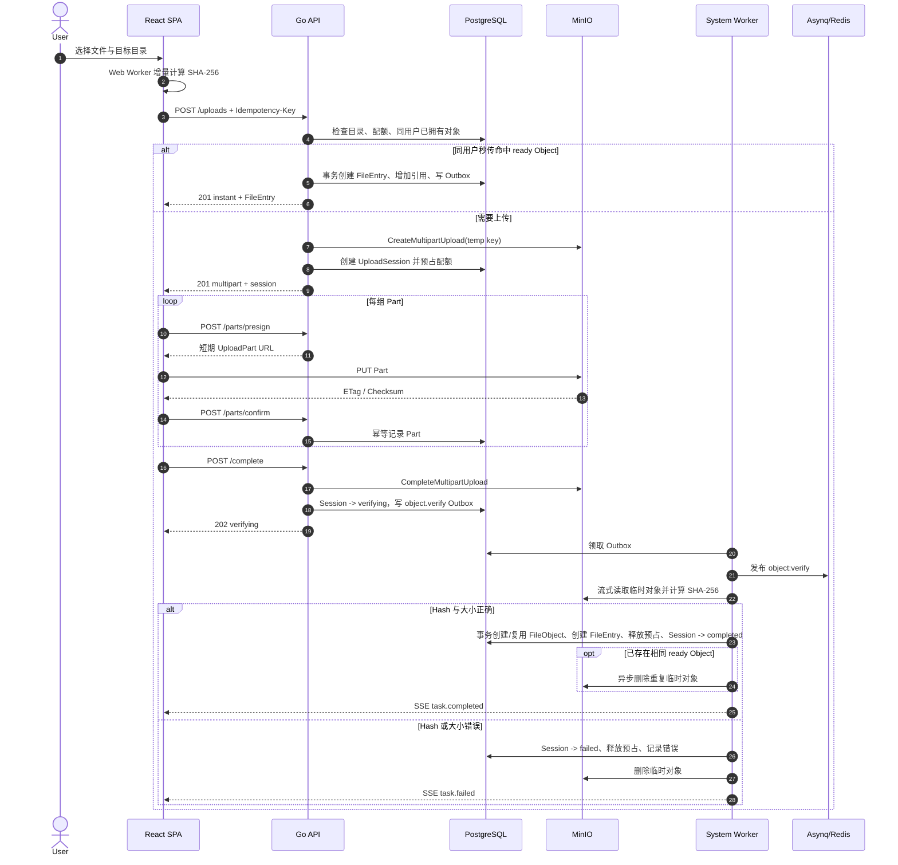
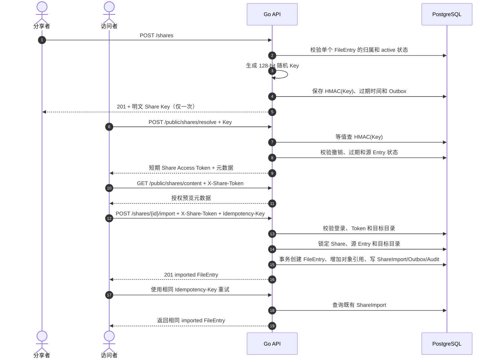
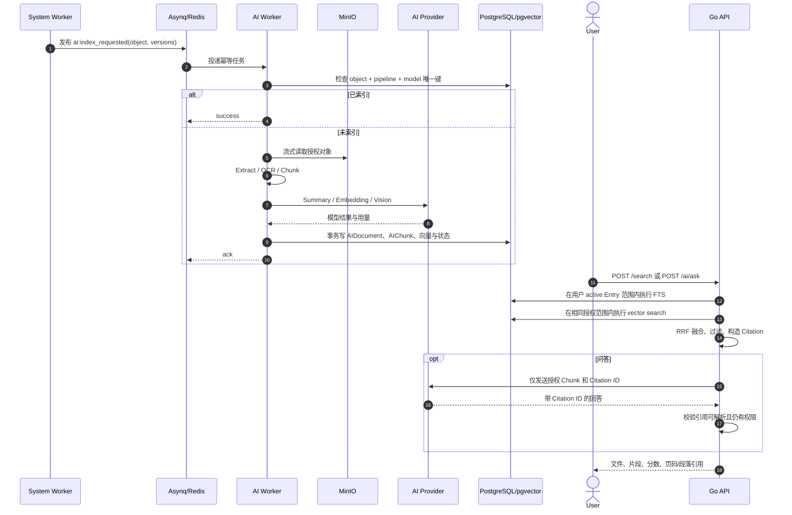

# BX YunPan 核心时序

- 版本：2.0
- 日期：2026-08-14
- 状态：M0 基线

## 1. Multipart 上传与强校验

关键不变量：

- `completed` Session 必须同时有 ObjectID 和 EntryID。
- ready FileEntry 只能引用 ready FileObject。
- 客户端 Hash 用于候选匹配，服务端流式 Hash 才能建立可信 Object。
- 重试 `POST /uploads`、`POST /complete` 和 Worker 任务不得创建重复 Entry 或增加两次引用。
- 数据库事务中不调用 MinIO；失败后的外部副作用通过补偿任务完成。

## 2. Share Key 解析与导入

固定语义：

- Share 是实时引用，不保存内容快照。
- 源 Entry 被删除或失去 active 状态后，访问与后续导入失效。
- 已经导入的 FileEntry 是独立逻辑引用，不受 Share 后续撤销或源删除影响。
- 导入不复制物理对象；文件重名返回 409，由用户选择新名称后重试。

## 3. AI 索引与权限感知问答

故障规则：

- 429、5xx、网络超时可重试；不支持的文件与无效模型响应进入明确失败状态。
- AI 失败不影响原文件下载和目录操作。
- 相同 FileObject 在相同 Pipeline/模型版本下只索引一次。
- 权限过滤必须进入 SQL，不允许全局向量召回后只靠应用层丢弃越权结果。
- 回答引用必须映射到当前用户可访问的 FileEntry 和 AIChunk。
